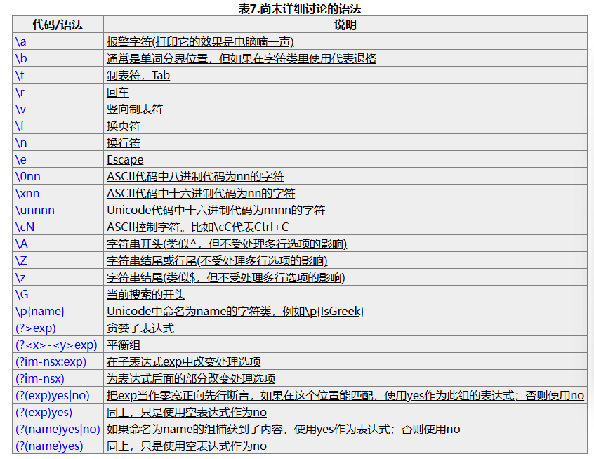

### ***Regex***

[**学习、受启发于deerchao的教程**](https://deerchao.cn/tutorials/regex/regex.htm)

> what is regex? something similer to wildcard, but more complex, more flexible and strong.

**matecharacter**: special character that has special rule to match characters.

> `.`: match anycharacters except `\n`
>
> `\w`: match letters, numbers, _ (and chinese), [a-z0-9A-Z_]
>
> `\s`: match blank characters include `\n`
>
> `\d`: match numbers
>
> `\b`: match the beginning or ending of characters, autually, it matches a place that one or both of former and latter character match `\w`
>
> `^`: match the beginning of characters
>
> `$`: match the ending of characters

examples:

`\bhi\b`: precise match "hi"

`\bhi\b.*\bLucy\b`: match "hi [...] lucy"

`\ba.*\b`: match words start with letter a

`\b\w{6}\b`: match words with 6 characters

`\b\d{5, 12}\b`: match numbers that no less than 5 digits and no more than 12 digits.

`\b\d{5, 12}@qq.com\b`: match QQ mail box

`^\w*@\w{?, ?}.\w{2, ?}$`: match any mail box(i have forgot how many characters a mail boox have).

**meaning-transform**: `\`, transform matecharacter into normal character if you want the matecharacter itself, including `\\`

example: `\($*\).o`: ?

**repetition**: \

> `*`: repeat zero or more times
>
> `+`: repeat one or more times
>
> `?`: repeat 0 or 1 times
>
> `{n}`: repeat n times
>
> `{n,}`: repeat n or more times
>
> `{n, m}`: repeat no less then n times but no more than m times

example: `^\w+`: match the first words in a sentense.

**character class**: to match none-matecharacters

`[aeiou]`, match a, e, i, o, u

`[.?!]`: match punctuation like ., ?, !

`[0-9]`: equal to `\d`

[a-z0-9A-Z_]: equal to `\w`

`\(?0\d{2}[)-]?\d{8}`: match phonre numbers start with 0

**if-else**: |

`\(?0\d{2}[)-]?\d{8}` actually can match characters (023-32142131, which is the wrong format.

the right answer is `\(0\d{2}\)[- ]?\d{8}|0\d{2}[- ]?\d{8}`

however, you should focus on the order, for example:

`\d{5}-\d{4}|\d{5}` is right, but `\d{5}|\d(5)-\d{4}` is wrong, because what matches `\d{5}-\d{4}` can match `\d{5}`, so it match `\d{5}` and would not think about the other branches. just like if-else conditions in C++ and python.

**group**: mostly for repetition of multi-characters, and auto-distribute group codes for groups, code 0 refer to the whole expression. 

`(\d{1,3}\.){3}\d{1,3}` repeat 3 times for `\d{1, 3}\.` .

`((2[0-4]\d|25[0-5]|[01]?\d\d?)\.){3}(2[0-4]\d|25[0-5]|[01]?\d\d?)`: matches right ip address. to under stand this expression, understanding `2[0-4]\d|25[0-5]|[01]?\d\d?`id the most important.

**autonymy**: like ! in python and C++

`\W`（capital, follow the same): `!\w`

`\S` , `\D` , `\B`, 

`[^exp]`: matches any characters except e, x, p

**backrefer**

by default, from lest to eight , marked by `(`, the group would automatically get a code from 1 on.

`\b(\w+)\b\s+\1\b` can match repeated words like `go go`. `\1` here is the content that `\w+` matched such as `go`.

`\b(?<Word>\w+)\b\s+\k<Word>\b`: match repeated words and assign the group with code `word`.

- capture: 

  > (exp): match and capture characters **into groups** and auto assign code.
  >
  > (?<name>exp): match and capture cahracters and assign the group `name` as code.
  >
  > (?:exp): match but not capture characters and also not assign codes.

- assert: match a position but not consume it.

  > (?=exp): matches location before exp, like ^.
  >
  > - `\b\w+(?=ing\b)` match characters before ing, such as:singing -> sing, dancing -> danc
  >
  > (?<=exp): matches location after exp,. like $.
  >
  > - `(?<=\bre)\w+\b` match characters after re, such as: reading -> ading, reset ->set.
  >
  > `(?<=\s)\d+(?=\s)`matches numbers that barrier by blank character.
  >
  > (?!exp): match a location that not follow by exp
  >
  > - `\b\w*q[^u]\w*\b`: matches words that have a q that without a u bellow, however it can also match a word that the q is the last letter of the word, for example, it can match`iraq fighting`. and `\b\w*q(?!u)\w*\b` is what you need because (?!u) would not consume the letter bellow the q.
  > - `\d{3}(?!\d)` match 3 numbers without a number bellow.
  > - `\b((?!abc)\w)+\b` match a word that do not contain the `abc`.
  >
  > (?<!exp): match a location that not following exp
  >
  > - `(?<![a-z])\d{7}` matches 7 numbers without lowercase letter on the front.
  >
  > `(?<=<(\w+)>).*(?=<\/\1>)` matches content in simple HTML label without attributes.

**comment**

use (?#comment) to contain comment like (?#这是注释)

active "ignore blank characters in mode" choice is recommended. and so that you can write commend like this:
```
(?<=    # 断言要匹配的文本的前缀
<(\w+)> # 查找尖括号括起来的内容
        # (即HTML/XML标签)
)       # 前缀结束
.*      # 匹配任意文本
(?=     # 断言要匹配的文本的后缀
<\/\1>  # 查找尖括号括起来的内容
        # 查找尖括号括起来的内容
)       # 后缀结束
```

**Greed and laziness**

regex always try to match as much as characters, for example, `aabab`, a.*b can match the whole characters but not only `aab`,  chich called greed.

sometimes we need regex match as less as it can. then we can simply add `?` bellow.

a.*?b match `aab`.

`*?`, `+?`, `??`, `{n, m}`, `{n,}`

**processing option**

`IgnoreCase`: ignore differences between capital letters and lowercase letters.

`Multiline`: change `^` and `$` . now they the beginning and ending of one line, not words.

`Singleline(dotAll)`: change `.`, make it can match all characters (including `\n`), and is not limited in one line.

`IgnorePatternWhitespace`: ignore unescaped white space in expression and active comments marked by #.

`ExplicitCapture`: only capture groups that have been explicitly tag.

***recursive matching**

match nesting multi-levels structure. but hard. omit.

``(?`group`)``, ``(?`-group`)``, ``(?(group)yes|no)``, (?!)

example:

```
<                   #最外层的左括号
  [^<>]*            #它后面非括号的内容
  (
      (
        (?'Open'<)  #左括号，压入"Open"
        [^<>]*      #左括号后面的内容
      )+
      (
        (?'-Open'>) #右括号，弹出一个"Open"
        [^<>]*      #右括号后面的内容
      )+
  )*
  (?(Open)(?!))     #最外层的右括号前检查
                    #若还有未弹出的"Open"
                    #则匹配失败

>                #最外层的右括号
```

### ***others***:



