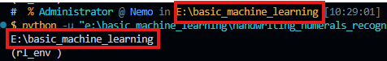

### The relative path is relative to the compiled directory of the instruction, not relative to the file itself

for example:

```
dir
	|
	+ dir1
		|
		+ relative.py
```

and in relative.py

```python
import os 

current_path = os.getcwd()

print(current_path)
```

execute relative.py, the output will be:

```bash
E:\dir
```

and this is your working directory:



